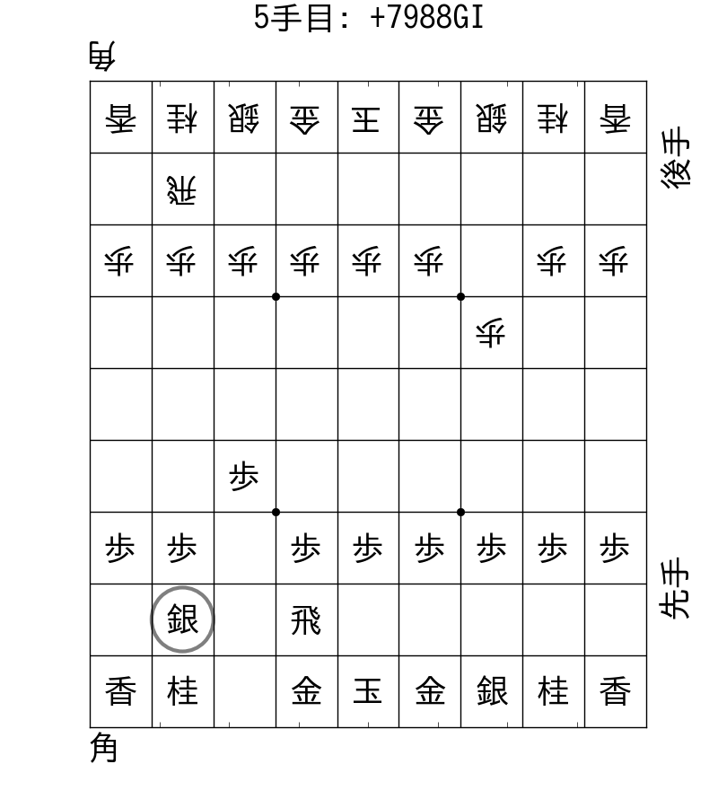

pyogi -- Shogi analysis in Python
===================================

Pyogi (**Py**thon s**yogi**) is a Python library for shogi analysis, display kifu, analyse kifu, crawl kifu.

# Feature
# Installation
Execute following command to compile all Cython script.

`python setup.py build_ext --inplace`

# Documentation
## Kifu included in this repository
Kifu data of KI2 format in `kifu/` were copies of kifu data in [2chkifu.zip](https://code.google.com/p/zipkifubrowser/downloads/detail?name=2chkifu.zip&can=2&q=).

## Typo in 2chkifu.zip
Prefer to collect these typo manually.

|File path      |Before                    |After                   |
|:--------------|:-------------------------|:-----------------------|
|20000/26161.KI2|`まで121手で上手の勝ちx\n` |`まで121手で上手の勝ち\n`|
|30000/39660.KI2|`まで116手で下手の勝ち\n銀`|`まで116手で下手の勝ち\n`|

## Other issue in 2chkifu.zip

* Special komaochi
  * 左銀落ち: 30000/35402.KI2
  * 右銀落ち: 30000/35641.KI2
* Special cases
  * 不戦敗: 40000/42991.KI2
  * 反則負け: 40000/43003.KI2
* KIF format
  * 40000/44479.KIF
  * 40000/50319.kif

# Reference
## Kifu data
* [棋譜貼りスレッド Part1～Part120　過去ログ](http://shogikakolog.web.fc2.com/)
* [日本将棋連盟公認 将棋ウォーズ ~ 将棋ゲームの決定版](http://shogiwars.heroz.jp/)
* [2chkifu.zip - zipkifubrowser - ki2 ziped archive - zip kifu browser for android - Google Project Hosting](https://code.google.com/p/zipkifubrowser/downloads/detail?name=2chkifu.zip&can=2&q=)
* [floodgate - コンピュータ将棋対局場](http://wdoor.c.u-tokyo.ac.jp/shogi/)

## How to describe kifu
* [棋譜の表記方法：日本将棋連盟](http://www.shogi.or.jp/faq/kihuhyouki.html)
* [将棋のルール「棋譜について」｜品川将棋倶楽部](http://ameblo.jp/written-by-m/entry-10365417107.html)
* [柿木将棋VIII](http://www.enterbrain.co.jp/game_site/kakinoki/function.html)
* [CSA標準棋譜ファイル形式 (V2.2)](http://www.computer-shogi.org/protocol/record_v22.html)

## Analysis using pyogi
* [「王手飛車をかけた方が負ける」は本当か - 盗んだ統計で走り出す](http://tosh1ki.github.io/data-an/2015/06/24/searchfork/)
